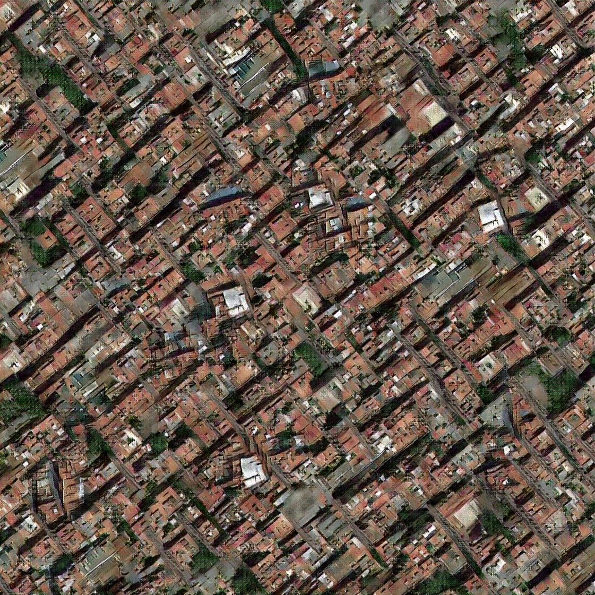
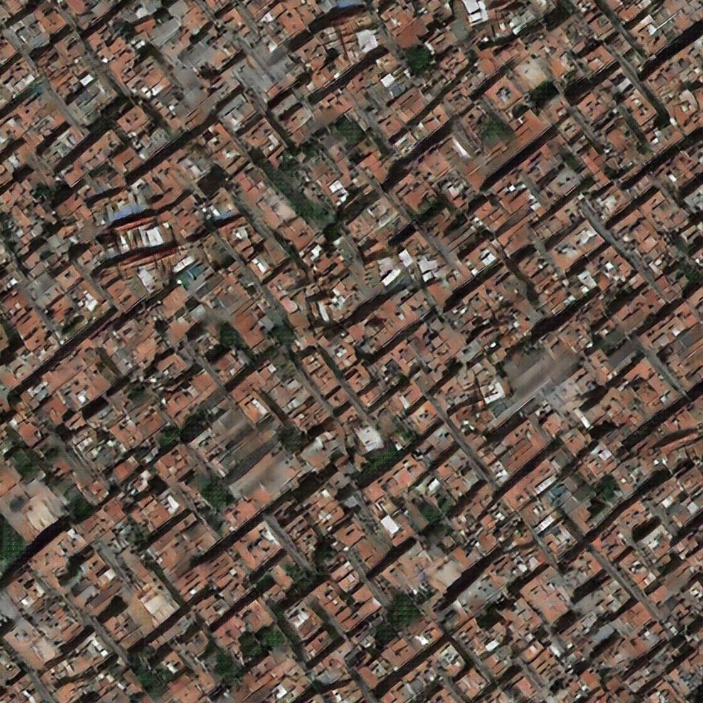

# Spatial Generative Adversarial Networks: Tensorflow


### Very Brief Model Description
SGANs can generate sample textures of arbitrary size that look strikingly similar - but not exactly the same - compared to a single (or several) source image(s).
- SGANs can be thought of as a convolutional roll-out of [Radford et al.'s](https://github.com/Newmu/dcgan_code) deep convolutional generative adversarial networks for texture synthesis
- the fully convolutional nature allows for real-time generation of high resolution images
- the method can fuse multiple source images and is highly scalable w.r.t. to output texture size and allows for generation of tiled textures

### Training the Model
All model parameters can be viewed by 
```
python run.py --help
```
We have tried to be consistent with the original implementation [https://github.com/ubergmann/spatial_gan](https://github.com/ubergmann/spatial_gan), however some alterations have been made.
To run the training, one needs to either adjust the parameters in run.py and use
```
python run.py
```
or 
```
python run.py --data_dir /path_to_data_dir/
```
In order to use metric regularization described [https://arxiv.org/pdf/1612.02136.pdf](https://arxiv.org/pdf/1612.02136.pdf) run
```
python run.py --data_dir /path_to_data_dir/ --reg True
```

### Generating results

For regular SGAN
```
python run.py --is_train False model_dir /path/to/dir/with/checkpoints
```
for metric regularized SGAN
```
python run.py --is_train False model_dir /path/to/dir/with/checkpoints --reg True
```

## License
This model was trained on a google maps image of barcelona, and yields a texture image like e.g. this



and for metric regularized



The MIT License (MIT)

Permission is hereby granted, free of charge, to any person obtaining a copy
of this software and associated documentation files (the "Software"), to deal
in the Software without restriction, including without limitation the rights
to use, copy, modify, merge, publish, distribute, sublicense, and/or sell
copies of the Software, and to permit persons to whom the Software is
furnished to do so, subject to the following conditions:

The above copyright notice and this permission notice shall be included in all
copies or substantial portions of the Software.

THE SOFTWARE IS PROVIDED "AS IS", WITHOUT WARRANTY OF ANY KIND, EXPRESS OR
IMPLIED, INCLUDING BUT NOT LIMITED TO THE WARRANTIES OF MERCHANTABILITY,
FITNESS FOR A PARTICULAR PURPOSE AND NONINFRINGEMENT. IN NO EVENT SHALL THE
AUTHORS OR COPYRIGHT HOLDERS BE LIABLE FOR ANY CLAIM, DAMAGES OR OTHER
LIABILITY, WHETHER IN AN ACTION OF CONTRACT, TORT OR OTHERWISE, ARISING FROM,
OUT OF OR IN CONNECTION WITH THE SOFTWARE OR THE USE OR OTHER DEALINGS IN THE
SOFTWARE.